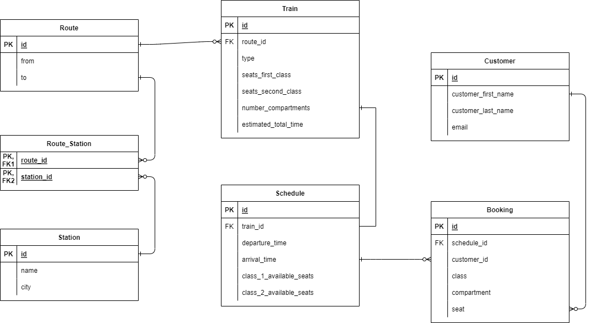

## RailwaysManagementSystem

The project is designed to model a train management system, seen from two perspectives:

<ol>
<li>Trains available to run on a certain route whose timetable is recorded.</li>
<li>A traveler who intends to make a booking according to the trains schedule.</li>
</ol>

<h1>Tools</h1>

For develope: Java with SpringBoot.

For unit testing: <b>junit</b>, <b>mockito</b>.

For integration testing: <b>junit</b>, <b>Testcontainers</b> and version <b>mysql:5-debian</b> for docker image of the database.

<h1>Database schema:</h1>

